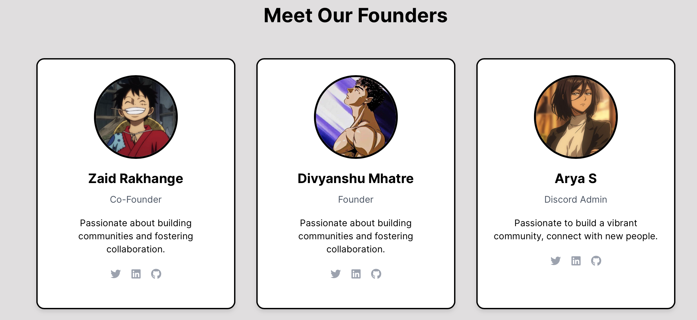

    
    <h1>
        Impic
    </h1>
    A Community of Programmers, Gamers, & more

 

     

# 🏆 About our Community

Our community brings together professionals and enthusiasts to share knowledge, collaborate on projects, and build lasting connections. Whether you're a seasoned expert or just starting out, you'll find a welcoming space to grow and learn.

 

# 🚀 Get Started

- Join our [Discord](https://discord.gg/6sFY5VZaW2) Community for discussions and exclusive giveaways
- Upload your Amazing [Projects](https://impic.vercel.app/project-registration)
- [Register](https://impic.vercel.app/registration) Yourselves as a Part of this Community
- Become a Part of [Discussions](https://github.com/orgs/ImpicDevs/discussions)
- Start you Journey with Open Source by Contributing to our [Projects](https://github.com/orgs/ImpicDevs/repositories)
